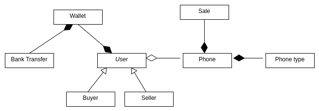

# **E-aukčný systém používaných iPhonov**

## Úvod

V poslednom čase, sa najmä vďaka platforme Swappie, začalo
obchodovať s používanými telefónmi značky Apple.

Môj projekt umožní používateľovi ponúknuť svoj používaný iPhone na aukciu,
kde ho odkúpi kupujúci za čo najvýhodnejšiu cenu.

V systéme bude možné predávať iPhone 7 a vyššie.

## Používatelia

Aplikácia má 2 typy užívateľov - predávajúci a kupujúci.
Predávajúci bude výhradne fyzická osoba a kupujúci bude výhradne právnická osoba.

Každý používateľ je povinný založiť si účet v aukčnej platforme.

## Predaj telefónu

Predávajúci vyberie:

- IMEI telefónu
- typ telefónu
- presné parametre telefónu
- stav
- fotografie
- vyvolávaciu cenou telefónu

Následne po aukcii dostane predajca notifikáciu o úspešnom alebo aj neúspešnom predaji.

Predajca manuálne začne a aj ukončí aukciu.

## Nákup telefónu

Kupujúci si nastaví, na ktoré typy telefónov chce byť notifikovaný.

Kupujúci dostane v každej aukcii možnosť navýšiť aktuálnu sumu, alebo sa vzdať kúpy.
Navyšovanie bude prebiehať vždy navýšením aktuálnej sumy, ktorú si vyberie kupujúci.

Následne po aukcii dostane nákupca notifikáciu o úspešnej kúpe.

## Platba

Všetky platby budú prebiehať cez aukčnú peňaženku.
Aukčnú penaženku bude mať každý používateľ.
Nabitie a vybratie peňazí z peňaženky bude možné cez bankový prevod.

## Prehľad

Používateľ si môže zobraziť stav peňaženky a prehľad predaných či nakúpených iPhonov.

## Diagram tried

