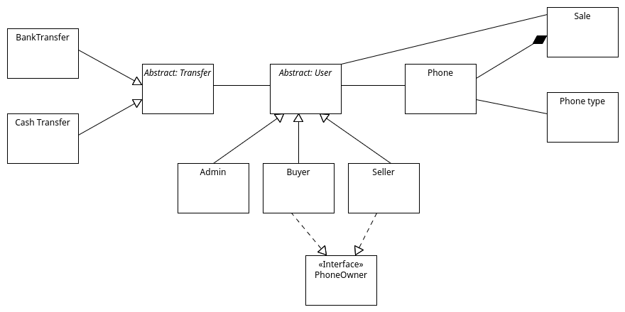

\pagebreak
# **Informácie o práci**

|                  |                                                |
| ---------------- | ---------------------------------------------- |
| **Názov**        | Správa o realizácii projektu                   |
| **Študent**      | Patrik Fejda                                   |
| **AIS ID**       | 110784                                         |
| **Univerzita**   | Slovenská technická univerzita v Bratislave    |
| **Fakulta**      | Fakulta informatiky a informačných technológií |
| **Predmet**      | OOP_B Objektovo-orientované programovanie      |
| **Rok**          | 2021/2022 Letný semester                       |
| **Cvičiaci**     | Ing. Peter Križan                              |
| **Prednášajúci** | doc. Ing. Valentino Vranić, PhD.               |
| **Skupina**      | 83 - Streda 18:00                              |

\pagebreak
# **E-aukčný systém používaných telefónov**

# Zámer projektu
## Úvod

V poslednom čase, sa najmä vďaka platforme Swappie, začalo
obchodovať s používanými telefónmi značky Apple.

Môj projekt umožní používateľovi ponúknuť svoj používaný iPhone na aukciu,
kde ho odkúpi kupujúci za čo najvýhodnejšiu cenu.

V systéme bude možné predávať iPhone 7 a vyššie.

## Používatelia

Aplikácia má 3 typy užívateľov - predávajúci, kupujúci a admin.
Predávajúci bude výhradne fyzická osoba a kupujúci bude výhradne právnická osoba.

Každý používateľ je povinný založiť si účet v aukčnej platforme.

## Predaj telefónu

Predávajúci vyberie:

- IMEI telefónu
- typ telefónu
- stav
- vyvolávaciu cenou telefónu
- cenu 'prihodenia'
- cenu automatického predaja

Predajca manuálne začne a aj ukončí aukciu, a vie telefón aj manuálne predať.

## Nákup telefónu

Kupujúci dostane v každej aukcii možnosť navýšiť aktuálnu sumu.
Navyšovanie bude prebiehať vždy navýšením aktuálnej sumy, ktorú si vyberie kupujúci.
Po prekročení ceny automatického predaja sa telefón predá automaticky.
## Platba

Všetky platby budú prebiehať cez aukčnú peňaženku.
Aukčnú penaženku bude mať každý používateľ.
Nabitie a vybratie peňazí z peňaženky bude možné cez bankový prevod alebo cez vklad/výber hotovosti.

## Prehľad

Používateľ si môže zobraziť stav peňaženky a prehľad svojich telefónov.

\pagebreak
# Kritéria hodnotenia

## Kritéria hodnotenia - hlavné

- Program je funkčný, zodpovedá zadaniu a zámeru projektu, ktoré schválil vyučujúci, vrátane implementácie požiadaviek vyučujúceho.
- Odovzdaný zdrojový kód zahŕňa všetky potrebné súbory a je ho možné preložiť vo vývojovom prostredí.
- Program obsahuje zmysluplné dedenie medzi vlastnými triedami s prekonávaním vlastných metód.
- V programe sa používa zapúzdrenie.
- Program obsahuje dostatok komentáru na pochopenie kódu.
- Dokumentácia zodpovedá programu a obsahuje diagram tried.

### Splenenie Hlavných kritérií hodnotenia

Hlavné kritéria boli splnené kompletne:

- program je v súlade so zadaním a zámerom projektu, pričom doň voli zapracované pripomienky vyučujúceho
- projekt adekvátne používa dedenie a polymorfizmus
- v projekte sa nachádzajú 2 oddelené hierarchie dedenia
- v projekte je použité vlastné rozhranie
- projekt obsahuje korektné zapúzdrenie a agregácie
- kód vhodne organizovaný, projekt je dôsledne roddelený - aplikačnej logiky od používateľského rozhrania (MVC)
- dokumentácia je kompletná, so všetkými položkami požadovanými podľa [zadania](http://www2.fiit.stuba.sk/oop/projekt/index.html#prg)

## Kritéria hodnotenia - vedľajšie

- Použitie návrhového vzoru MVC
  - [Model](../../src/main/java/model)
  - [View](../../src/main/views/com/example/controller)
  - [Controller](../../src/main/java/com/example/controller)
- Použitie návrhového vzoru Observer (Notifikácia o zlom prihlásení)
  - [Subject](../../src/main/java/com/example/controller/TelegramNotification.java)
    - [ObserverCollection<>](../../src/main/java/com/example/controller/TelegramNotification.java#L28)
    - [registerObserver()](../../src/main/java/com/example/controller/TelegramNotification.java#L36)
    - [unregisterObserver()](../../src/main/java/com/example/controller/TelegramNotification.java#L46)
    - [notifyObservers()](../../src/main/java/com/example/controller/TelegramNotification.java#L55)
  - [Observer](../../src/main/java/model/User.java)
    - [update()](../../src/main/java/model/User.java#L23)
  - [Concrete Observer](../../src/main/java/model/Admin.java)
    - [update()](../../src/main/java/model/Admin.java#L27)
- Ošetrenie mimoriadneho stavu prostredníctvom vlastnej výnimky (Nesprávne odoslaná notifikácia)
  - [Trieda `TelegramException`](../../src/main/java/com/example/controller/TelegramException.java)
- Multithreading (Volanie Notify observers)
  - [Odloženie volania notifikácie o n sekúnd](../../src/main/java/com/example/controller/LoginController.java#L124)
- Explicitné použitie RTTI (Blokovanie predaja kupcovi a naopak)
  - [Blokovanie prístupu kupcovi ku `AddPhone`](../../src/main/java/com/example/controller/CustomerZoneController.java#L71)
  - [Blokovanie prístupu kupcovi ku `SellPhone`](../../src/main/java/com/example/controller/CustomerZoneController.java#L41)
  - [Blokovanie prístupu predajcovi ku `BuyPhone`](../../src/main/java/com/example/controller/CustomerZoneController.java#L56)
- Použitie implicitnej implementácie metód v rozhraniach (Implementácia PhoneOwner metód)
  - [Interface `Phone Owner`](../../src/main/java/model/PhoneOwner.java)
  - [Implicitnej implementácia - `Seller`](../../src/main/java/model/Seller.java#L10)
  - [Implicitnej implementácia - `Buyer`](../../src/main/java/model/Buyer.java#L14)
- Použitie serializácie (Serializácia typov telefónov)
  - [Implementácia serializácie](../../src/main/java/com/example/controller/PhoneTypeReadWrite.java)
  - [Serializácia](../../src/main/java/com/example/controller/AddPhoneTypeController.java#L69)
  - [Deserializácia](../../src/main/java/com/example/controller/Main.java#L57)

Z vedľajších kritérií bolo splnených 8 kritérií.

# Diagram tried

# Verzie projektu

- Verzia 1.0 [c44df3ca059bcfd83ef67cc157faef3e31697c0c](https://github.com/OOP-FIIT/oop-2022-str-18-b-krizan-patrikfejda/commit/c44df3ca059bcfd83ef67cc157faef3e31697c0c) - **Single window**
- Verzia 1.1 [b52178b5c5404533f46374fef456ca3e96d63d77](https://github.com/OOP-FIIT/oop-2022-str-18-b-krizan-patrikfejda/commit/b52178b5c5404533f46374fef456ca3e96d63d77) - **Login page, Customer portal page, dark mode**
- Verzia 1.2 [59494b19e2c010848d5aa6c15432a0bd5d8bad14](https://github.com/OOP-FIIT/oop-2022-str-18-b-krizan-patrikfejda/commit/59494b19e2c010848d5aa6c15432a0bd5d8bad14) - **UC pridanie telefónu**
- Verzia 1.3 [48e4081c04ca8f09935aa0c0892441753433b227](https://github.com/OOP-FIIT/oop-2022-str-18-b-krizan-patrikfejda/commit/48e4081c04ca8f09935aa0c0892441753433b227) - **Telegram notifikácia, serializácia typov telefónov, rozšírenie Main UC**
- Verzia 2.0 [4ee5856f2c64aedd175cc6f89e6c6e2f7e5db3c0](https://github.com/OOP-FIIT/oop-2022-str-18-b-krizan-patrikfejda/commit/4ee5856f2c64aedd175cc6f89e6c6e2f7e5db3c0) - **Beta - Pracovná verzia programu**
- Verzia 3.0 [final](https://github.com/OOP-FIIT/oop-2022-str-18-b-krizan-patrikfejda) - **Finálna verzia programu**